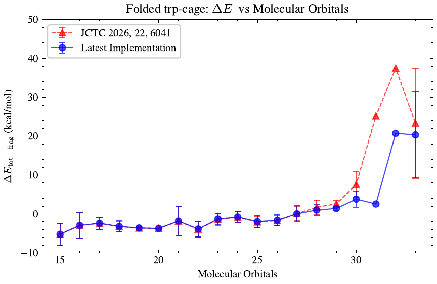
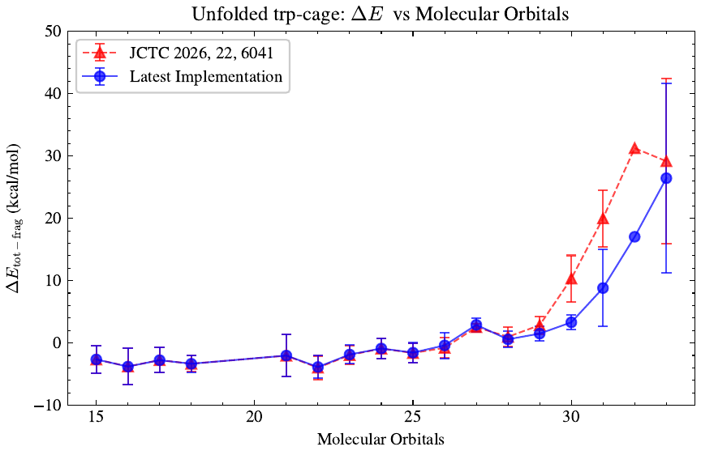

# Trp-cage Single-Point Energies

Two generations of this code applied to the same system, so the effect of the
implementation change can be measured rather than asserted.

| Directory | Code generation | Contents |
|---|---|---|
| [`JCTC_2026/`](JCTC_2026/) | Published | EWF-(FCI,SQD) data as it appears in [*JCTC* **2026**, *22* (12), 6041–6056](https://pubs.acs.org/jctcce/article/22/12/6041/5166449/Molecular-Quantum-Computations-on-a-Protein), plus EWF-CCSD reference data |
| [`Latest_Implementation/`](Latest_Implementation/) | Current | Re-run of both conformers with the GPU-accelerated SBD eigensolver |

Both cover the **folded** and **unfolded** Trp-cage conformers, fragmented into
303 clusters, with the largest clusters solved by ext-SQD and the rest
classically. The chemistry is identical; only the eigensolver and its
convergence settings differ.

---

## What changed: CPU → GPU SBD

The published calculations used the **CPU implementation** of the SBD
eigensolver. It worked, but it was slow enough that the Davidson
diagonalization had to be run with a **loose convergence threshold** to fit 303
clusters into a practical compute budget. A loose threshold is less robust: the
subspace diagonalization stops before it has fully converged, leaving each
cluster energy slightly *above* where it should be.

The current code uses a **GPU-accelerated SBD diagonalizer**. The same Davidson
procedure now costs little enough that it can be run to a **much tighter
threshold**. The consequence is direct:

- Each individual cluster converges to a **lower total energy**
- Those lower energies are in **better agreement with the per-cluster CCSD
  reference**
- The improvement is concentrated in the **large clusters**, which are exactly
  the ones where a loose threshold hurt most

Nothing about the embedding, the fragmentation, or the quantum sampling changed.
The improvement comes entirely from being able to afford a properly converged
diagonalization.

---

## Per-cluster agreement with CCSD

The figures below plot, for every cluster, how far its ext-SQD energy sits from
the CCSD reference for that same cluster:

```
ΔE_tot−frag  =  (E_ext-SQD  −  E_CCSD)  ×  627.509474      [kcal/mol]
```

Clusters are grouped by size (number of molecular orbitals); each point is the
**mean** over all clusters of that size and the error bar is the **standard
deviation** within the group. **Lower is better** — a positive ΔE means the SQD
energy has not come all the way down to CCSD.

- **Red, dashed** — published results (*JCTC* **2026**, *22* (12), 6041–6056)
- **Blue, solid** — latest implementation

Both curves are ext-SQD data and share the same published per-cluster CCSD
reference, so the comparison isolates the eigensolver change.

### Folded conformer — the more stable one



*(vector version: [`trpcage_folded_deltaE_vs_MO_avg.pdf`](../../Documentation/Images/trpcage_folded_deltaE_vs_MO_avg.pdf))*

| Cluster size (MO) | 26 | 27 | 28 | 29 | **30** | **31** | **32** | **33** |
|---|---|---|---|---|---|---|---|---|
| Published (red) | −1.71 | 0.12 | 1.77 | 2.65 | **7.60** | **25.24** | **37.49** | **23.37** |
| Latest (blue) | −1.59 | 0.07 | 1.05 | 1.45 | **3.85** | **2.59** | **20.73** | **20.33** |

### Unfolded conformer — the less stable one



*(vector version: [`trpcage_unfolded_deltaE_vs_MO_avg.pdf`](../../Documentation/Images/trpcage_unfolded_deltaE_vs_MO_avg.pdf))*

| Cluster size (MO) | 23 | 25 | 27 | 28 | 29 | **30** | **31** | **32** | **33** |
|---|---|---|---|---|---|---|---|---|---|
| Published (red) | −1.94 | −1.61 | 2.53 | 0.98 | 2.85 | **10.33** | **20.00** | **31.25** | **29.16** |
| Latest (blue) | −1.86 | −1.55 | 2.90 | 0.58 | 1.50 | **3.31** | **8.81** | **17.03** | **26.44** |

### How to read them

Both conformers show the same pattern. Below roughly **28 orbitals** the two
curves lie on top of each other — small clusters converge tightly even with a
loose threshold, so there was nothing to improve. Above that the curves separate
sharply, and the blue curve sits well below the red one throughout: at 30
orbitals the deviation from CCSD drops from 7.60 to 3.85 kcal/mol (folded) and
from 10.33 to 3.31 kcal/mol (unfolded).

The **spread narrows** as well, not just the mean — the folded MO=33 group goes
from 23.37 ± 14.17 to 20.33 ± 11.07 kcal/mol. A tighter Davidson threshold makes
the large-cluster results more reproducible, which is the practical meaning of
"more robust".

---

## Conformer relative energy

The quantity of physical interest is how much less stable the unfolded conformer
is than the folded one. An unfragmented **DLPNO-CCSD** calculation provides the
reference:

| Method | ΔE (unfolded − folded) | Error vs reference |
|---|---|---|
| **DLPNO-CCSD, unfragmented** (reference) | **52.05 kcal/mol** | — |
| EWF-(FCI,SQD), published | 55.43 kcal/mol | **+3.38** |
| EWF-(FCI,SQD), latest implementation | **52.89 kcal/mol** | **+0.84** |

The error against the unfragmented reference falls from **3.38 to 0.84
kcal/mol** — a fourfold reduction that brings the fragmented calculation to
**within 1 kcal/mol** of the unfragmented result.

This follows from the per-cluster improvement above. The published run
overshot the large-cluster energies in *both* conformers, but not by equal
amounts, so the error did not cancel in the difference. Converging each cluster
properly removes most of that imbalance.

---

## Reproducing the comparison

Everything needed is in this directory. The per-cluster energies are recorded in
each run's driver log under `[driver] Per-cluster energies (heff + eris):`, one
line per cluster in fragment-index order:

```
                   N  E_cluster = -118.3623729597 Ha  [SQD, norb=17]
```

The solver tag distinguishes ext-SQD clusters from classically solved ones, and
`norb` gives the cluster size used to group the points. Each conformer's
assembled total energy — the basis of the relative energy above — comes from the
`[driver] EWF-FCI/SQD energy:` line, which is independent of the per-cluster
analysis.

See [`../README.md`](../README.md) for which large intermediate files are
omitted from these example directories and how to regenerate them.
