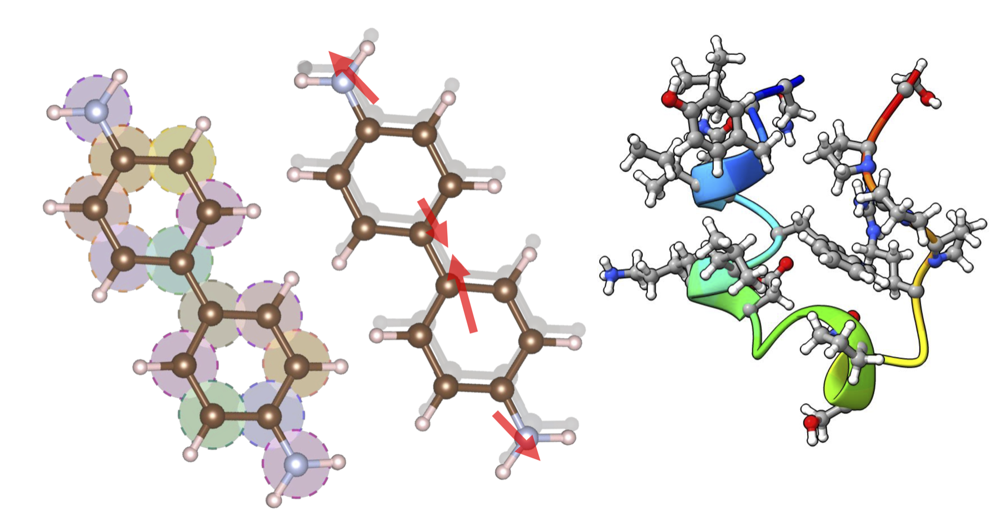

# EWF-Based Geometry Optimization

Deployment of **geometry optimization driven by Embedded Wave Function (EWF) analytic nuclear gradients**, built on [Vayesta](https://github.com/BoothGroup/Vayesta)-style quantum embedding with FCI / Selected-CI / SCI-SBD / **SQD** (Sample-based Quantum Diagonalization) cluster solvers, [PySCF](https://pyscf.org/) integrals, and a choice of geometry optimizer — [geomeTRIC](https://geometric.readthedocs.io/), [PyBerny](https://github.com/jhrmnn/pyberny), or [Sella](https://github.com/zadorlab/sella). The workflow distributes per-fragment cluster solves over Slurm on an HPC cluster and assembles a global density-matrix whose analytic gradient feeds each optimization step.

The same machinery also drives **large-scale single-point energy calculations**. This is demonstrated here on the **Trp-cage protein**, in both its folded and unfolded conformers, fragmented into 303 clusters with the largest treated by sample-based quantum diagonalization — see [`Examples/Trp-cage_Single_Point/`](Examples/Trp-cage_Single_Point/).

*Left — a benzidine molecule with translucent colored spheres marking the EWF fragments. Center — the same molecule with red arrows showing nuclear gradients driving the optimization. Right — the Trp-cage protein used for the large-scale single-point demonstration.*

- **This work** — Kaliakin, D.; Shajan, A.; Liang, F.; Li, Z.; Merz, K. M., Jr. *Quantum-Centric Geometry Optimization with Wave-Function-Based Embedding*. [arXiv:2607.16410](https://arxiv.org/abs/2607.16410)
- **Trp-cage single-point simulations** — *Molecular Quantum Computations on a Protein*. [*J. Chem. Theory Comput.* **2026**, *22* (12), 6041–6056](https://pubs.acs.org/jctcce/article/22/12/6041/5166449/Molecular-Quantum-Computations-on-a-Protein)

---

## Related project

This repository is a **sister project** to
[**quantum-fragment-methods**](https://github.com/qiskit-community/quantum-fragment-methods)
in the [Qiskit Community](https://github.com/qiskit-community) organization. Both
develop EWF-SQD — fragment-based quantum embedding with sample-based quantum
diagonalization — with deliberately complementary aims:

| Project | Focus |
|---|---|
| **This project** | Novel, frontier functionality for EWF-SQD: analytic nuclear gradients, geometry optimization, and new density-assembly routes — capability that is still experimental and being established |
| [**quantum-fragment-methods**](https://github.com/qiskit-community/quantum-fragment-methods) | Integrating EWF-SQD into the Qiskit software ecosystem: closer alignment with [`qiskit-addon-sqd`](https://github.com/qiskit/qiskit-addon-sqd), a stable and user-friendly interface, and a containerized deployment |

Methods are explored here and hardened there. If you want a supported, packaged
EWF-SQD implementation to *use*, start with **quantum-fragment-methods**. If you
are interested in the research frontier of the method — gradients, geometry
optimization, new ways of assembling the global density — this is the right
place.

---

## Repository layout

| Path | Contents |
|---|---|
| [`Source/`](Source/) | Driver, gradient code, Λ-relaxation module, cluster solvers, HPC-settings loader, interactive config generator |
| [`Examples/`](Examples/) | Example outputs and config files |
| [`Utilities/`](Utilities/) | Standalone analysis tools — Slurm job diagnostics, geometry comparison, fragmentation-effect analysis (each documented in [`Utilities/README.md`](Utilities/README.md)) |
| [`Documentation/`](Documentation/) | Full documentation, split by topic (see *Documentation* below) |
| [`Documentation/Images/`](Documentation/Images/) | Centralized image folder — every figure referenced from any README in this repository lives here |

### Source files

| File | Role |
|---|---|
| `EWF-CI_Geom_Opt_HPC.py` | Main driver: run-mode dispatch, fragment construction, Slurm orchestration, RDM assembly dispatch, optimizer backends (geomeTRIC / PyBerny / Sella) |
| `embedding_lagrangian.py` | `rdm_t_lambda` assembly: global effective amplitudes + Λ (Z-vector) relaxed density |
| `isolated_casci_gradient.py` | Analytic gradients: the EWF gradient `build_ewf_grad` (integral derivatives + CPHF orbital response) and the full-system CASCI gradient `build_grad` |
| `external_sci.py` | `SCI_SBD` solver: PySCF Selected-CI growth with the external SBD eigensolver (CPU or GPU), driven through files and per-cycle Slurm sub-jobs |
| `sqd_solver.py` | `SQD` solver: sample-based quantum diagonalization — quantum-sampled bitstrings drive an iterative SBD subspace-recovery loop (one Slurm job per parallel batch) followed by a final ext-SQD SBD job with PyCI single-excitation augmentation |
| `sqd_quantum_sampling.py` | Quantum-sampling source for `SQD`: either reuses a pre-collected `count_dict.txt` or runs an LUCJ ansatz on an IBM Quantum backend via Qiskit IBM Runtime + ffsim |
| `zigzag_layout.py` | Heavy-hex zigzag physical-qubit layout selector used by the LUCJ ansatz when `SQD` samples on the fly |
| `sbd_wrapper.py` | Parser for the external SBD solver's output — energies, timings, Davidson iteration counts |
| `hpc_settings.py` | HPC site definitions: loads and normalizes a `<name>_HPC_settings.yaml`, and renders the chosen settings into the `config.yaml` Slurm blocks and `submit_slurm_*` scripts |
| `calculation_setup.py` | Interactive generator for a focused `config.yaml` (see [Usage → Generating a config](Documentation/Usage.md#generating-a-config-calculation_setuppy)) |

---

## Documentation

Full documentation lives in [`Documentation/`](Documentation/):

| Document | Contents |
|---|---|
| [Installation](Documentation/Installation.md) | Core and optional dependencies — optimizer backends, GPU-accelerated HF, the external SBD eigensolver, SQD quantum sampling |
| [Theory](Documentation/Theory.md) | The EWF energy, its analytic nuclear gradient, and the density-response term |
| [Density-assembly routes](Documentation/Density_Assembly_Routes.md) | The routes that turn per-fragment solutions into one global density, and how they differ |
| [Run modes and tasks](Documentation/Run_Modes_and_Tasks.md) | What `run_mode` and `run_task` select |
| [Usage](Documentation/Usage.md) | Generating a `config.yaml`, the full option reference, solver and Slurm settings |
| [Running](Documentation/Running.md) | Launching the workflow, worker modes, and restarting an interrupted run |

---

## Examples

**[`Examples/`](Examples/)** — example outputs driver logs, per-step energies/gradients, optimized geometries as well as configuration files.

---

## Utilities

Standalone helper tools live in [`Utilities/`](Utilities/); each is documented in full in **[`Utilities/README.md`](Utilities/README.md)**.

| Tool | Purpose |
|---|---|
| [`slurm_jobs_check.py`](Utilities/slurm_jobs_check.py) | Post-mortem diagnostic for the workflow's multi-layer Slurm jobs (DUMP / SOLVE / SBD sub-jobs): resolves each JobID, runs `seff`, and explains failures — especially out-of-memory — pointing at the exact config knob to raise. |
| [`geom_compare.py`](Utilities/geom_compare.py) | Kabsch-aligned RMSD / max-deviation comparison of optimized geometries against a reference structure. |
| [`fragmentation_effect_analysis.py`](Utilities/fragmentation_effect_analysis.py) | Batch comparison of fragmented (EWF) vs. unfragmented optimized geometries across many molecules, emitting an ACS-style LaTeX table + a structure-overlay figure. |
| [`quantum_sampling_effect_analysis.py`](Utilities/quantum_sampling_effect_analysis.py) | Same framework, SQD counterpart: batch comparison of EWF SQD vs. EWF SCI optimized geometries, emitting the same LaTeX table + structure-overlay figure. |
| [`circuit_data_analysis.py`](Utilities/circuit_data_analysis.py) | Collects LUCJ circuit sizes (qubits / 2-qubit depth / CNOT count) for the smallest and largest SQD-treated EWF cluster per molecule, across one or more folders of molecule subfolders; emits a LaTeX table + PDF. |
| [`bulk_calculations_setup.py`](Utilities/bulk_calculations_setup.py) | Interactive **bulk** setup: one ready-to-run folder (code template + geometry + `config.yaml`) per geometry in an input folder, from a single set of answers (reuses `Source/calculation_setup.py`). |

See **[`Utilities/README.md`](Utilities/README.md)** for requirements, usage, options, and output formats.
